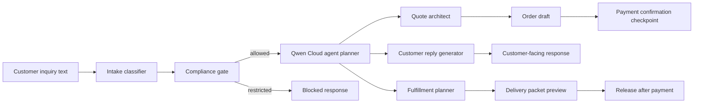

# Architecture



## Runtime Modes

- `qwen-cloud`: uses the Qwen Cloud OpenAI-compatible API.
- `deterministic-demo`: no key required; useful for judging, CI, and demos.
- `deterministic-fallback`: used if the live API is unavailable.

## Deployment

The app can run on Alibaba Cloud ECS as a simple Node.js process:

```bash
npm install
npm run start
```

Bind to `127.0.0.1` by default and put it behind a managed HTTPS reverse proxy only when a public demo is needed.
