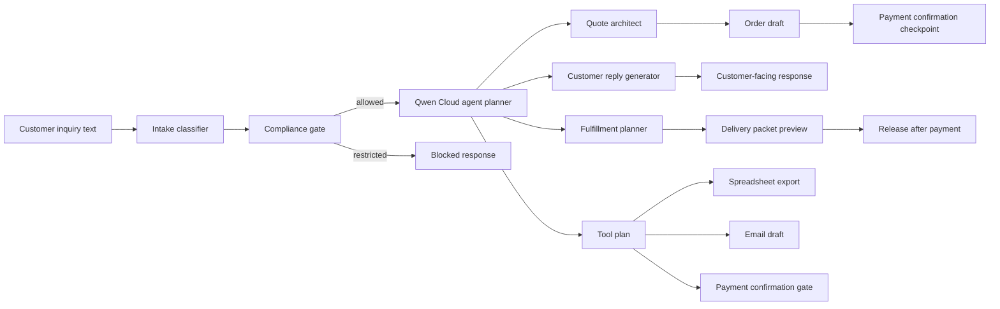

# Architecture



## Runtime Modes

- `qwen-cloud`: uses the Qwen Cloud OpenAI-compatible API.
- `deterministic-demo`: no key required; useful for judging, CI, and demos.
- `deterministic-fallback`: used if the live API is unavailable.

## Technical Depth Evidence

- Qwen Cloud live mode is isolated in `src/qwenClient.mjs`, which calls the OpenAI-compatible chat completions endpoint, requests JSON output, and enforces a bounded timeout.
- `src/workflow.mjs` normalizes model output into a stable packet contract so shape drift cannot break the quote, checklist, delivery preview, or tool plan sections.
- The packet exposes a `toolPlan` that names external-system boundaries: compliance check, spreadsheet export, email draft, payment confirmation, and delivery packaging.
- Human checkpoints are workflow gates, not presentation copy. Payment confirmation, restricted topics, external posting, and custom scope approval remain gated.
- Reproducibility is covered by `npm test`, `npm run demo`, `npm run demo:zh`, `npm run live:smoke`, `npm run deployment:proof`, `npm run submission:bundle`, and `npm run validate`.

See `docs/technical-depth-evidence.md` for the detailed engineering evidence used in the final submission.

## Deployment

The app can run on Alibaba Cloud ECS as a simple Node.js process:

```bash
npm install
npm run start
```

Bind to `127.0.0.1` by default and put it behind a managed HTTPS reverse proxy only when a public demo is needed.
